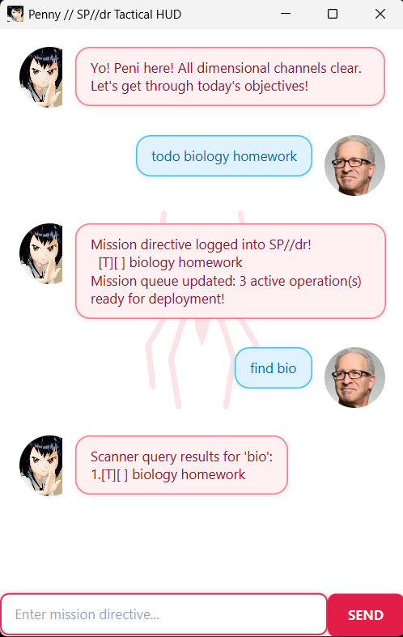

# Penny // SP//dr Tactical HUD &mdash; User Guide

**Penny** is a lightweight, responsive desktop task manager featuring a **Peni Parker & SP//dr** themed interface. It combines the speed of a Command Line Interface (CLI) with the clarity of a Graphical User Interface (GUI), allowing you to manage tasks seamlessly through intuitive typed directives.



---

## Table of Contents
1. [Quick Start](#quick-start)
2. [Command Notes & Conventions](#command-notes--conventions)
3. [Features & Commands](#features--commands)
   * [Adding a Todo: `todo`](#1-adding-a-todo-todo)
   * [Adding a Deadline: `deadline`](#2-adding-a-deadline-deadline)
   * [Adding an Event: `event`](#3-adding-an-event-event)
   * [Listing All Tasks: `list`](#4-listing-all-tasks-list)
   * [Marking a Task as Completed: `mark`](#5-marking-a-task-as-completed-mark)
   * [Marking a Task as Incomplete: `unmark`](#6-marking-a-task-as-incomplete-unmark)
   * [Finding Tasks by Keyword: `find`](#7-finding-tasks-by-keyword-find)
   * [Checking Tasks on a Date: `on`](#8-checking-tasks-on-a-date-on)
   * [Deleting a Task: `delete`](#9-deleting-a-task-delete)
   * [Exiting the Application: `bye`](#10-exiting-the-application-bye)
4. [Data Storage](#data-storage)
5. [FAQ](#faq)
6. [Command Summary](#command-summary)
7. [Acknowledgements & AI Assistance](#acknowledgements--ai-assistance)

---

## Quick Start

1. Ensure you have **Java 17** (or **Java 25**) installed on your computer.
2. Clone or download this repository onto your computer.
3. Open a terminal (PowerShell, Command Prompt, or Terminal) in the root directory of the project.
4. Launch Penny using Gradle:
   * **Windows:**
     ```powershell
     .\gradlew.bat run
     ```
     or try
     ```powershell
     ./gradlew.bat run
     ```
   * **macOS / Linux:**
     ```bash
     ./gradlew run
     ```
5. The graphical HUD will appear. Type a directive in the input box at the bottom and press `Enter` (or click **SEND**) to execute it.

---

## Command Notes & Conventions

* **Case-insensitive command words:** Command words (`todo`, `deadline`, `event`, `mark`, `unmark`, `find`, `on`, `delete`, `list`, `bye`) can be entered in any case (e.g., `TODO`, `Todo`, or `todo`). Flag specifiers (`/by`, `/from`, `/to`) must be in lowercase.
* **1-based index:** Task numbers used in `mark`, `unmark`, and `delete` refer to the numbering shown in the `list` command (e.g., `1` for the first task).
* **Date formats supported:**
  * `yyyy-MM-dd` (e.g., `2026-10-15`)
  * `d/M/yyyy` (e.g., `15/10/2026`, `2/12/2026`)
  * Optional time: `HHmm` or `HH:mm` (e.g., `1800` or `18:00`)
* **Delimiter protection:** The pipe symbol `|` is a reserved storage delimiter and cannot be used inside task descriptions.

---

## Features & Commands

### 1. Adding a Todo: `todo`
Adds a basic task without any date or time constraints.

* **Format:** `todo <description>`
* **Example:** `todo biology homework`
* **Expected Output:**
  ```text
  Mission directive logged into SP//dr!
    [T][ ] biology homework
  Mission queue updated: 1 active operation(s) ready for deployment!
  ```

---

### 2. Adding a Deadline: `deadline`
Adds a task that must be completed by a specific date and optional time.

* **Format:** `deadline <description> /by <date [time]>`
* **Examples:**
  * `deadline submit cs2103t iP /by 2026-09-18 2359`
  * `deadline return library book /by 15/10/2026`
* **Expected Output:**
  ```text
  Mission directive logged into SP//dr!
    [D][ ] submit cs2103t iP (by: Sep 18 2026, 11:59pm)
  Mission queue updated: 2 active operation(s) ready for deployment!
  ```

---

### 3. Adding an Event: `event`
Adds a task occurring across a time window with a start and end boundary.

* **Format:** `event <description> /from <start_date [time]> /to <end_date [time]>`
* **Examples:**
  * `event robotics exhibition /from 2026-10-20 1400 /to 2026-10-20 1700`
  * `event camp /from 1/11/2026 /to 3/11/2026`
* **Expected Output:**
  ```text
  Mission directive logged into SP//dr!
    [E][ ] robotics exhibition (from: Oct 20 2026, 2:00pm to: Oct 20 2026, 5:00pm)
  Mission queue updated: 3 active operation(s) ready for deployment!
  ```

---

### 4. Listing All Tasks: `list`
Displays all tasks currently tracked in the mission queue with their index numbers and completion statuses.

* **Format:** `list`
* **Expected Output:**
  ```text
  Mission roster active. Here's what's on the radar:
  1.[T][ ] biology homework
  2.[D][ ] submit cs2103t iP (by: Sep 18 2026, 11:59pm)
  3.[E][ ] robotics exhibition (from: Oct 20 2026, 2:00pm to: Oct 20 2026, 5:00pm)
  ```

---

### 5. Marking a Task as Completed: `mark`
Marks the specified task as done (`[X]`).

* **Format:** `mark <task_number>`
* **Example:** `mark 1`
* **Expected Output:**
  ```text
  Direct hit! Objective completed:
    [T][X] biology homework
  ```

---

### 6. Marking a Task as Incomplete: `unmark`
Reverts a completed task back to an incomplete state (`[ ]`).

* **Format:** `unmark <task_number>`
* **Example:** `unmark 1`
* **Expected Output:**
  ```text
  Recalibrating sensor grid! Objective marked incomplete:
    [T][ ] biology homework
  ```

---

### 7. Finding Tasks by Keyword: `find`
Finds tasks containing the specified search terms in their descriptions.

* **Format:** `find <keyword> [additional_keywords]...`
* **Search Capabilities:**
  * **Partial Matching:** Matches substrings within words (e.g., `bio` matches `biology`, `home` matches `homework`).
  * **Conjunctive Multi-Keyword Search (AND):** When multiple space-separated words are provided, Penny returns tasks that contain **all** terms, regardless of word order.
  * **Case-Insensitive:** Searching for `BIO` or `bio` yields the exact same results.
* **Examples:**
  * `find bio` &mdash; Finds tasks containing `bio`.
  * `find bio home` &mdash; Finds tasks containing both `bio` and `home` (such as `biology homework`).
  * `find homework biology` &mdash; Finds `biology homework` (order-independent).
* **Expected Output:**
  ```text
  Scanner query results for 'bio':
  1.[T][ ] biology homework
  ```

---

### 8. Checking Tasks on a Date: `on`
Filters and lists all deadlines and events that occur on the specified date.

* **Format:** `on <date>`
* **Examples:**
  * `on 2026-09-18`
  * `on 18/9/2026`
* **Expected Output:**
  ```text
  Scanning tactical map for Sep 18 2026...
  1.[D][ ] submit cs2103t iP (by: Sep 18 2026, 11:59pm)
  ```

---

### 9. Deleting a Task: `delete`
Removes a task from the list and decreases remaining task indices.

* **Format:** `delete <task_number>`
* **Example:** `delete 2`
* **Expected Output:**
  ```text
  Target scrubbed from tactical logs:
    [D][ ] submit cs2103t iP (by: Sep 18 2026, 11:59pm)
  Mission queue updated: 2 active operation(s) ready for deployment!
  ```

---

### 10. Exiting the Application: `bye`
Closes the session and displays a farewell message.

* **Format:** `bye`
* **Expected Output:**
  ```text
  SP//dr power grid entering standby. Stay safe in your dimension!
  ```

---

## Data Storage

Penny automatically saves your task list to disk after every modifying command (`todo`, `deadline`, `event`, `mark`, `unmark`, `delete`).

* **File Location:** `data/penny.txt` (relative to the working directory).
* **Automatic Creation:** If the file or parent folder does not exist when Penny launches, they are created automatically.
* **Format:** Plain text pipe-separated values (e.g., `T | 0 | biology homework`).
* **Manual Editing:** Advanced users can edit `data/penny.txt` directly. If invalid formatting is detected, Penny will start with an empty list while alerting you to the error without crashing.

---

## FAQ

**Q: How do I run Penny on a different computer without Gradle?**  
**A:** You can package Penny into a standalone JAR file using `./gradlew shadowJar`. Once built, run it on any machine with Java installed using `java -jar build/libs/penny.jar`.

**Q: Where is my data saved?**  
**A:** Your tasks are saved in `data/penny.txt` inside the directory where you executed Penny.

**Q: Can I use 12-hour AM/PM format when adding deadlines?**  
**A:** When adding tasks, use 24-hour time format (e.g., `1400` or `14:00`). Penny will automatically display it in friendly 12-hour format with AM/PM (e.g., `2:00pm`).

---

## Command Summary

| Action | Command Format | Example |
| :--- | :--- | :--- |
| **Add Todo** | `todo <description>` | `todo biology homework` |
| **Add Deadline** | `deadline <description> /by <date [time]>` | `deadline submit assignment /by 2026-09-18 2359` |
| **Add Event** | `event <description> /from <start> /to <end>` | `event exhibition /from 2026-10-20 1400 /to 2026-10-20 1700` |
| **List Tasks** | `list` | `list` |
| **Mark Done** | `mark <task_number>` | `mark 1` |
| **Unmark Done** | `unmark <task_number>` | `unmark 1` |
| **Find Tasks** | `find <keywords>` | `find bio home` |
| **Date Query** | `on <date>` | `on 2026-09-18` |
| **Exit** | `bye` | `bye` |

---

## Acknowledgements & AI Assistance

* **AI Tool:** Google Antigravity (powered by Gemini) 
* **Model Used:** Gemini 3.7 Flash, Gemini 3.8 Flash
* **Author / User:** [@zao05](https://github.com/zao05)
* **Extent of Use:** Google Antigravity was used as an interactive AI pair-programming assistant throughout the development of this project. It assisted in architecture planning, code generation, refactoring, writing comprehensive JUnit 5 test suites, JavaFX GUI theming and styling, resolving Checkstyle violations, and drafting documentation.